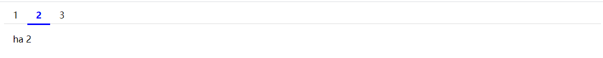

# ha-tabs

### 安装
```
npm install ha-tabs
```

### 使用
```
import HaTabs from 'ha-tabs';
import 'ha-tabs/lib/ha-tabs.css';

Vue.use(HaTabs);

<template>
  <div id="app">
   <ha-tabs v-model="activeItem">
      <ha-tabs-head>
        <ha-tabs-item :name="1">1</ha-tabs-item>
        <ha-tabs-item :name="2">2</ha-tabs-item>
        <ha-tabs-item :name="3">3</ha-tabs-item>
        <ha-tabs-item :name="4">4</ha-tabs-item>
        <ha-tabs-item :name="5">5</ha-tabs-item>
      </ha-tabs-head>
      <ha-tabs-body>
        <ha-tabs-pane :name="1">ha 1</ha-tabs-pane>
        <ha-tabs-pane :name="2">ha 2</ha-tabs-pane>
        <ha-tabs-pane :name="3">ha 3</ha-tabs-pane>
        <ha-tabs-pane :name="4">ha 4</ha-tabs-pane>
        <ha-tabs-pane :name="5">ha 5</ha-tabs-pane>
      </ha-tabs-body>
    </ha-tabs>
  </div>
</template>
```

### ha-tabs props

|     参数      |           说明            |  类型  |
| :-----------: | :-----------------------: | :----: |
| value/v-model | 绑定值，选中选项卡的 name | string |

### ha-tabs events

| 事件名称  |   说明   |       回调参数        |
| :-------: | :------: | :-------------------: |
| tab-click | 点击tabs | 被选中的标签 tab 实例 |

### ha-tabs-item props

| 参数 |                       说明                        | 类型   |
| :--: | :-----------------------------------------------: | ------ |
| name | 与选项卡绑定值 value 对应的标识符，表示选项卡别名 | string |

### 效果


